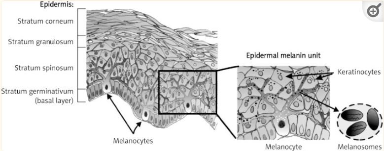

# Suggestions to make valid relationships in the skin table v1.4 (20/03/2024)

Please, add a comment below if you want to address any of the actions to be taken. Please, indicate the number before the comment.
**IMPORTANT** The order of the two classes in these pages is the same as it is found in the tables (e.g. AS4 &rarr; AS5)

## AS&rarr;AS

**1 - hypodermis &rarr; vasculature of integument**

vasculature of integument is too general. A new term is needed.

**2 - skin epidermis &rarr; stratum corneum of epidermis**

This relationship exists in Uberon, but is not reflected in Ubergraph and OLS.

**3 - dermis &rarr; sebaceous gland**

This looks correct, but both in Uberon and FMA is part of the epidermis. It will need to be edited.

**4 - dermis &rarr; eccrine sweat gland**

This looks correct, but both in Uberon and FMA is part of the epidermis. It will need to be edited.

**5 - dermis &rarr; apocrine gland**

This looks correct, but both in Uberon and FMA is part of the epidermis. It will need to be edited.

**6 - dermis &rarr; vasculature of integument**

vasculature of integument is too general. A new term is needed.

**7 - skin of body &rarr; hypodermis**

I have found conflicting information. There are sources [that support this relationship](PMID: 30726010). However, there are others that consider the hypodermis ("under the skin" in greek) as part of the integument, but not part of the skin. Uberon follows the second view. However, I might be able to add a relationship that can validate.

**8 - hypodermis &rarr; skin nerve field**

The author's lable 'nerve' and the Uberon term 'skin nerve field' are not equivalent. The 'skin nerve field' is innerveted by nerves.

## CT&rarr;CT

**No issues**

## AS&rarr;CT

**1 - skin nerve field &rarr; Neuron**

Neuron is too broad. Is the relationship expected `innervates`? There has been some discussion recently about using relationships that are not 'part of' and they are discouraged.

**2 - vasculature of integument &rarr; endothelial cell**

'endothelial cell' is too broad. A compund term would be the best solution, otherwise a new term is required.

**3 - hypodermis &rarr; B cell**

For immune system no action is planned yet. Compund terms can be a solution.

**4 - stratum granulosum of epidermis &rarr; keratinocyte**

The specific keratinocyte for the stratum granulosum in CL is `granular cell of epidermis` (CL:0002189), it can be used instead of keratinocyte.

**5 - hypodermis &rarr; macrophage**

For immune system no action is planned yet. Compund terms can be a solution.

**6 - hypodermis &rarr; neutrophil**

For immune system no action is planned yet. Compund terms can be a solution.

**7 - hypodermis &rarr; mast cell**

For immune system no action is planned yet. Compund terms can be a solution.

**8 - stratum granulosum of epidermis &rarr; epidermal Langerhans cell**

A 'has part' axiom can be added. Need to confirm that they are present across species in the stratum granulosum.

**9 - stratum spinosum of epidermis &rarr; epidermal Langerhans cell**

A 'has part' axiom can be added.

**10 - stratum spinosum of epidermis &rarr; Merkel cell**

Merkel cells are only found in the stratum basale.

**11 - stratum basale of epidermis &rarr; epidermal Langerhans cell**

A 'has part' axiom can be added. Need to confirm that they are present across species in the stratum basale.

**12 - stratum basale of epidermis &rarr; melanocyte of skin**

That is correct, it should be edited (overlaps [Cichorek et al., 2013](https://pubmed.ncbi.nlm.nih.gov/24278043)) or add 'has part'.

**13 - hair follicle &rarr; keratinocyte stem cell**

This relationship is reflected in the 'keratinocyte stem cell' textual definition, but it is missing the axiom.

**14 - eccrine sweat gland &rarr; myoepithelial cell of sweat gland**

**15 - apocrine gland &rarr; myoepithelial cell of sweat gland**

**16 - dermis &rarr; myoepithelial cell of sweat gland**

**17 - dermis &rarr; mast cell**

For immune system no action is planned yet. Compund terms can be a solution.

**18 - dermis &rarr; macrophage**

For immune system no action is planned yet. Compund terms can be a solution.

**19 - dermis &rarr; T-helper 1 cell**

For immune system no action is planned yet. Compund terms can be a solution.

**20 - dermis &rarr; cytotoxic T cell**

For immune system no action is planned yet. Compund terms can be a solution.

**21 - dermis &rarr; regulatory T cell**

For immune system no action is planned yet. Compund terms can be a solution.

**22 - dermis &rarr; natural killer cell**

For immune system no action is planned yet. Compund terms can be a solution.

**23 - dermis &rarr; group 1 innate lymphoid cell**

A compund term woul be a good solution, otherwise a new cell term will be the best solution.

**24 - dermis &rarr; group 2 innate lymphoid cell**

A compund term woul be a good solution, otherwise a new cell term will be the best solution.

**25 - dermis &rarr; group 3 innate lymphoid cell**

A compund term woul be a good solution, otherwise a new cell term will be the best solution.

**26 - dermis &rarr; B cell**

For immune system no action is planned yet. Compund terms can be a solution.

**27 - dermis &rarr; plasma cell**

For immune system no action is planned yet. Compund terms can be a solution.

**28 - dermis &rarr; neutrophil**

For immune system no action is planned yet. Compund terms can be a solution.

**29 - dermis &rarr; eosinophil**

For immune system no action is planned yet. Compund terms can be a solution.

**30 - dermis &rarr; Schwann cell**

This is a very broad term, not specific for skin. A compund term would be a good solution, or ad a 'has part' axiom.

**31 - dermis &rarr; perineurial cell**

This might be resolved either with compound terms or with 'has part' axioms.

**32 - dermis &rarr; vascular associated smooth muscle cell**

A compund term woul be a good solution, otherwise a new cell term will be the best solution.

**33 - dermis &rarr; type I cell of carotid body**

Is [glomus body](http://purl.obolibrary.org/obo/UBERON_8410076) (aka [glomus coccygeum](http://purl.obolibrary.org/obo/UBERON_8410076)) the structure that the SME was thinking of? All the markers and literature are for [glomus cell](http://purl.obolibrary.org/obo/CL_0002292), but it isn't located in the skin.

**34 - dermis &rarr; pericyte**

This might be resolved either with compound terms or with 'has part' axioms.

**35 - dermis &rarr; pericyte cell**

This row is duplicated and should be erased.

**36 - hypodermis &rarr; endothelial cell of lymphatic vessel**

This might be resolved either with compound terms or with 'has part' axioms.

**37 - hypodermis &rarr; skin fibroblast**

This might be resolved either with compound terms or with 'has part' axioms.

**38 - hypodermis &rarr; T-helper 1 cell**

For immune system no action is planned yet. Compund terms can be a solution.

**39 - hypodermis &rarr; cytotoxic T cell**

For immune system no action is planned yet. Compund terms can be a solution.

**40 - hypodermis &rarr; regulatory T cell**

For immune system no action is planned yet. Compund terms can be a solution.

**41 - hypodermis &rarr; eosinophil**

For immune system no action is planned yet. Compund terms can be a solution.

**42 - hypodermis &rarr; Schwann cell**

**43 - hypodermis &rarr; perineurial cell**

**44 - hypodermis &rarr; smooth muscle cell**

**45 - hypodermis &rarr; type I cell of carotid body**

Is [glomus body](http://purl.obolibrary.org/obo/UBERON_8410076) (aka [glomus coccygeum](http://purl.obolibrary.org/obo/UBERON_8410076)) the structure that the SME was thinking of? All the markers and literature are for [glomus cell](http://purl.obolibrary.org/obo/CL_0002292), but it isn't located in the skin.

**46 - dermis &rarr; skin fibroblast**

There is a more specific term: `fibroblast of dermis` (CL:0002551). Currently it validates with 'has part'.