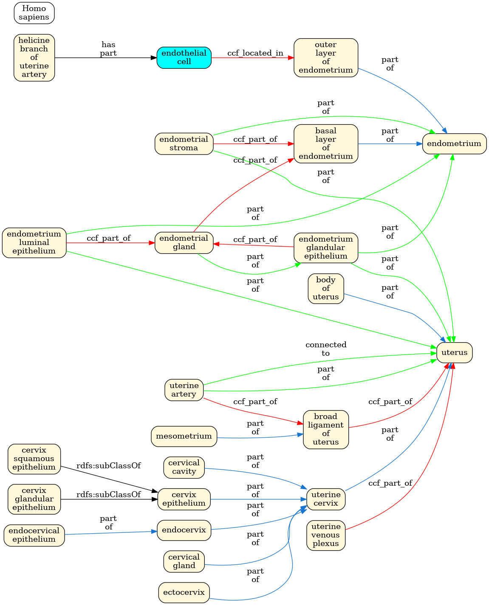

ASCT+B Validation Reports for Uterus (2023-08-31)
=================================================

# ASCT+B as Graph

This is the representation of the ASCT+B table as a graph. The UBERON (AS) terms are represented in cream colour, and CL (CT) terms are represented in light blue colour.

The red edges in the graph indicate relationships present in the ASCT+B table but are not currently found in the CL or Uberon ontologies. We use the relationship *ccf_located_in* to link CL to UBERON terms and *ccf_part_of* to link UBERON terms. **They are non-validated relationships.**

The blue, black, or dark green edges are relationships in the CL or Uberon ontologies. **They are valid relationships.**

The light green edges are relationships in the CL or Uberon ontologies. There is at least one light green edge as a **suggestion relationship** when there's a red edge. If there isn't a light green edge for a red edge, there isn't in the ontology a relationship between the original term and any other term in the graph.

Please ensure that all terms have a relationship that is part of the path to the leading term in the ASCT+B table. Verify if there isn't a gap between the two levels without UBERON or CL terms in the ASCT+B table.

Please ensure that there isn't the same term in two levels on the same row. In the graph, it is represented as a red-edge relationship to the term itself.

[*View image as PDF*](assets/ccf_Uterus_graph.pdf)

